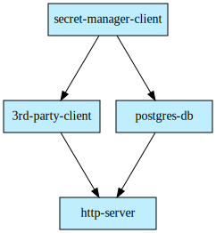

<h1 align="center" style="border-bottom: none">
    </a>
    <br>
    Fuse
</h1>

Fuse is a golang project generator. It is not a framework, but rather a tool that helps you create and maintain your project structure. The main goal is to make dependency injection easy, provide minimum boilerplate code and to make it easy to add new components to your project.

## Installation

Ensure that you have [Go](https://golang.org/) 1.18 or higher installed. To install this cli, run the following command:

```text
go install github.com/hjblom/fuse@latest
```

Verify that the binary installed correctly by running the help command.

```bash
fuse --help
```

Output

```text
A go project generator.

Usage:
  fuse [command]

Available Commands:
  add         Add components to the project
  completion  Generate the autocompletion script for the specified shell
  generate    Generate code for the project based on the configuration file
  help        Help about any command
  init        Initialize a new fuse project
  visualize   Visualize the project dependency graph

Flags:
  -c, --config string   Path to the config file (default ".fuse.yaml")
  -h, --help            help for fuse
  -t, --toggle          Help message for toggle

Use "fuse [command] --help" for more information about a command.
```

## Quick start

### Create a new project

Create a new project by running the `init` command.

```bash
fuse init my-service
```

This will initialize the project in the current directory and generate a default project structure.

```text
cwd
├── cmd <todo>
│   └── main.go
|-- internal
│   |-- config.go
│   └── fuse.go
└── .fuse.yaml
```

- `config.go` contains the configuration for the module. This will automatically be updated with packages that require configuration.
- `fuse.go` wires all dependencies together and is the entrypoint for the project.

### Add a package

```bash
fuse add package client -t config
```

This will create a new directory with the name `client` and generate a default package structure.

```text
cwd
└── client
    |-- config.go
    |-- client.go
    └── interface.go
...
```

- `config.go` contains the configuration for the package. This was automatically generated because the `config` tag was added. See TODO for more information on which tags are available.
- `client.go` contains the implementation of the package.
- `interface.go` contains the interface for the package.

To see additional options, add the `--help` flag to the `add` command.

```bash
fuse add package --help
```

## Visualize

The `visualize` command generates a dependency graph of the project. It will generate a `graph.svg` file in the current directory.

```bash
fuse visualize
```

A sample graph generated by the example `.fuse.yaml` in the project:

<h1 align="center" style="border-bottom: none">
    </a>
</h1>
